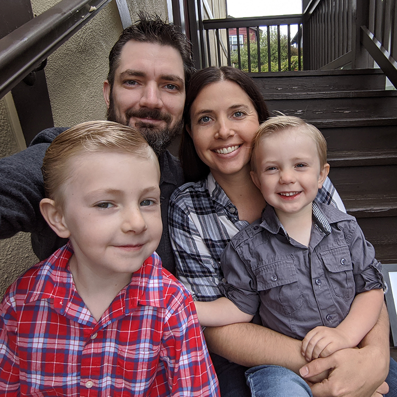

<figure class="alignright">
  {{}}
</figure>

Hi, I'm <a href="https://willnorris.com/" class="p-name u-url fn url">Will Norris</a>. I'm a
follower of Jesus, a husband to [Elisabeth][], a father to [Gabriel][] and [Judah][], a citizen of
the [indie web][], and the Open Source Lead at Twitter.

Prior to Twitter I was at Google [for 10 years][], with most of that time spent in their [Open
Source Programs Office][] leading the engineering and license compliance groups.  I had previously
helped design and build the [Google+ API][], having spent much of my career working on developing
tools and technologies for the social web like [OpenID][], [OAuth][], [XRD][], and [Activity
Streams][].  I also spent a number of years in the enterprise identity management space working on
[Shibboleth][] and LDAP directories at [USC][].

Almost all of my personal projects these days are [indie web][] related, mostly [written in go][].
I'm also a huge fan of [WordPress][] and their mission to democratize publishing.  Even though I no
longer use WordPress for this site, I still manage other WordPress-powered site, and continue to
maintain a number of [plugins][] and occasionally contribute to WordPress core and WordPress for
Android.

### Contact ###

I can be contacted by email at will @ this domain or by phone at +1 (901)
484-9455.  I'm "willnorris" on most sites.  I'm not interested in hearing about job
opportunities.

[Elisabeth]: https://notsoserendipitous.com/
[Gabriel]: https://gabenorris.com/
[Judah]: https://judahnorris.com/
[indie web]: https://indieweb.org/
[for 10 years]: /2020/09/leaving-google/
[Open Source Programs Office]: https://opensource.google/
[Google+ API]: https://en.wikipedia.org/wiki/Google+
[OpenID]: https://openid.net/
[OAuth]: https://oauth.net/
[XRD]: http://docs.oasis-open.org/xri/xrd/v1.0/xrd-1.0.html
[Activity Streams]: https://activitystrea.ms/
[Shibboleth]: https://shibboleth.net/
[USC]: https://www.usc.edu/
[written in go]: /go/
[WordPress]: https://wordpress.org/
[plugins]: https://profiles.wordpress.org/willnorris

### Colophon ###

[This site][] is powered by [Hugo][], hosted on [Google Cloud Platform][] and all of my domains are
registered with [Google Domains][] (which I [highly recommend][]).  [Short URLs][] for my content are
resolved using a small server I wrote called [gum][].  Most images are proxied through my
[imageproxy][] server to handle simple things like dynamic resizing.

[This site]: https://github.com/willnorris/willnorris.com
[Hugo]: https://gohugo.io
[Google Cloud Platform]: https://www.google.com/cloud
[Google Domains]: https://www.google.com/domains
[highly recommend]: /2014/06/google-domains
[Short URLs]: /wiki/shorturls
[gum]: /go/gum
[imageproxy]: /go/imageproxy
