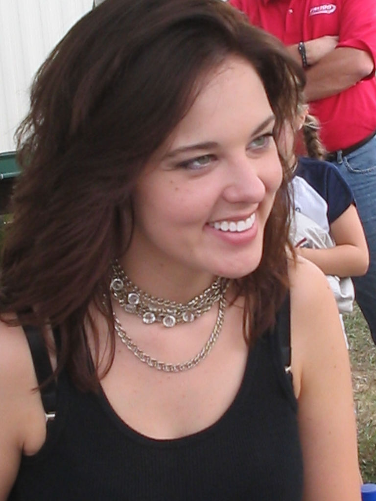

I just barely caught on the radio this afternoon that Anna Nalick was playing at a free concert at Shelby Farms today,
and took no time deciding I was going to go, seeing as how she just recently topped my "[Top Artists][]" chart.  (Though
I do doubt the accuracy of that chart, she is certainly my favorite new artist.)

<aside class="alignleft"><figure>
  
</figure></aside>

Either she is just an incredibly cool girl, or she has got one hell of a PR person (or maybe both).  Just everything
about her was spot-on -- the concert, after the concert, how she presented herself, everything.  The music was
exceptional, though I was a little nervous at first.  I had never seen her live, and she was just a bit "off" on her
first song (Citadel)... I figured she just wasn't going to be a great live artist.  But after a couple of songs she had
loosened up and really began to have fun with it all.  Her stage presence seemed very natural and relaxed -- talking
about her love of Southern style, joking about the band, and flirting a bit with the audience.  The performance was
great, but what really impressed me was afterward.

An autograph booth was set up off to the side of the stage, with two tables positioned between a length of chain-link
fence on either side to provide a bit of separation between the artist and the fans.  When Anna made it over to the
booth, the first thing she did was pull the table back and sit on the front of it so that she was right there next to
the fans - she apparently didn't like the separation.  This made it much more personal, and allowed for easy posing with
fans for pictures (not having to try to lean across the table and all).  Like any good artist, she had 8x10 photos there
that you could have her sign.  Most artists (including the other ones at this event) typically sell these for $1-2, not
enough to really turn a huge profit, but at the very least cover their costs.  Instead Anna simply gave these away to
everyone.  Sure she lost a few hundred dollars in potential revenue, but now there are 200-300 people with a nice
professional photo of her that is personalized and signed, and is probably already hanging on their wall somewhere --
instant fans.  When signing autographs she was taking the time to talk to people and answer questions... certainly not
in a rush to get out of there.  When one of the event staff pointed out how long her autograph line was (she hadn't
really noticed), she kinda shrugged it off and said she didn't mind staying as long as she needed to so long as the next
band didn't need the table to do their autographs.  Again, it's really the small things that can have a tremendous
impact on how an artist is received.

Not that it had much to do with my opinion of the show, but I had a short moment to ask her about her music.  There is a
noticable spiritual undertone in several of her songs (namely "Wreck of the Day" and "Digame"), and I asked her if this
was intentional.  She seemed a little bit hesitant to say that she was "religious" but did say that she was a very
spiritual person and that it was probably natural that it would show through in her writing.  Now I don't know if her
hesitation was the result of a PR consultant advising her not to be too outright with her faith, or if she is into the
kinda new-age "I'm spiritual, but not religious" thing so many celebrities have taken to.  (Update: after reading [her
online journal][], I'm quite confident it's not the latter)  She did however notice my ring with the Star of David
(while [we were taking a picture][] no less) and asked if I was Jewish.  I get that question a fair amount, so I simply
replied with my standard, "No, I'm a Christian, but I really admire King David."

Anna Nalick "get's it".  Amazing natural talent, welcoming stage presence, and a deliberate effort to be close and
personable with her fans -- if this is any indication of how other aspects of her career are handled now and in the
future, she's certainly going to make it big.  (And in case you hadn't noticed, she's quite pretty too!)

[Top Artists]: https://last.fm/user/hugwill#topartists
[her online journal]: https://www.annanalick.com
[we were taking a picture]: https://www.flickr.com/photos/wnorris/23182954/in/photostream/
