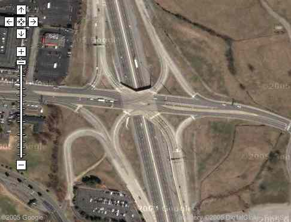

I'm leaving later this afternoon to drive to Nashville and so I went to [google maps][] this morning to double check my
directions. I found a good map of where I was going and was pretty sure I determined which exit I wanted, but couldn't
quite tell if the exit ramp went the direction I needed. Google satellite photos to the rescue...

<figure class="aligncenter">
  
</figure>

I also got a nice shot of all the [parking lots][] around the area. Imagine how useful that would be for a downtown
event.

[google maps]: http://maps.google.com
[parking lots]: http://www.google.com/maps?ll=36.213,-86.697&spn=0.011,0.015&t=k
