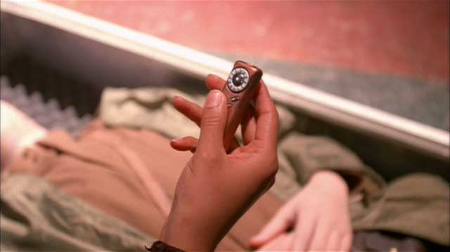

I've taken a few friends' advice and decided to watch the entire [Firefly][] series before I watch [Serenity][].  I'm on
the last disc, and was surprised to see a cameo appearance by the [iPod Shuffle][]... well, sorta.  In the episode
entitled "The Message", a soldier has recorded is final wishes on a small audio device that bears a striking resemblence
to Apple's little marvel.  The really interesting thing though is that Firefly aired in 2002, almost three years before
the Shuffle's release.  So who really designed it, Johnathan Ives or Joss Whedon?

<figure class="aligncenter">
  
  
</figure>

<small>(and I can't be the first to notice this similarity... anyone know?)</small>

[firefly]: http://imdb.com/title/tt0303461/
[serenity]: http://imdb.com/title/tt0379786/
[iPod Shuffle]: http://www.apple.com/ipodshuffle/
