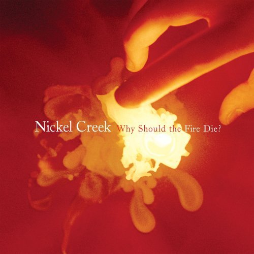

<figure class="alignleft">
  
</figure>

I got hooked on Nickel Creek several years ago after hearing <cite>The Lighthouse's Tale</cite>, like I imagine a lot of
people did.  When <cite>This Side</cite> came out, I didn't like it quite as much at first, but after a few spins
through it really started to grow on me.  What at first seemed to just be rather esoteric, I later came to appreciate as
a new level of musical maturity in their songwriting.  I now list it among my favorite albums.

And now with <cite>Why Should the Fire Die?</cite>, I'm back in the same position -- it's just not doing it for me aside
from a couple of tracks I love (especially <cite>Best of Luck</cite>, specifically Sara's part).  I'll hold too much
criticism in hopes that I'll come to appreciate it more after a little time, but there are just some things that really
don't sit well with me on this album.  The most prominent on my first listen was the "tin box" feel the whole album has.
The opening track starts this guitar lick that sounds like it's been recorded on a really old vinyl.  After about 5-10
seconds it breaks open and the audio is much clearer... it sounds very nice.  But even then, everything sounds like it
were EQ'd really weird -- I'm no audiophile, but I know enough about running live sound to recognize bad EQing.  That
isn't to say Eric Valentine (who engineered and produced the album) doesn't know what he's doing.  Quite the contrary,
I'm sure the overall sound was very intentional and they worked very hard to get it to sound like it does, I'm just
saying I don't like it as much as what Alison Krauss delivered (she produced their first two albums).
