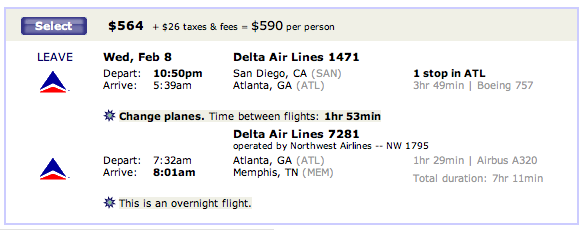
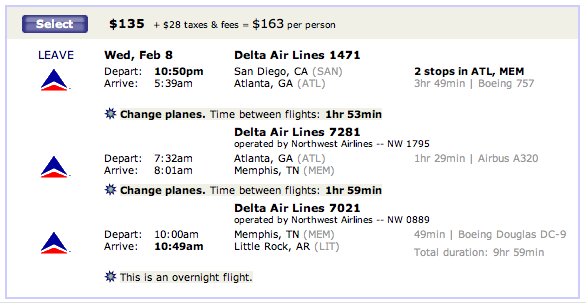

Observe -- a flight from San Diego to Memphis with one layover in Atlanta costs $564.  A flight from San Diego to Little
Rock with a layover in Atlanta and a layover in Memphis costs $135.  Note that they are the exact same flights from San
Diego to Atlanta and from Atlanta to Memphis. 

<figure class="aligncenter">
  
  
</figure>

Please explain to me why it costs $429 *less* to fly 137 miles *further*.
