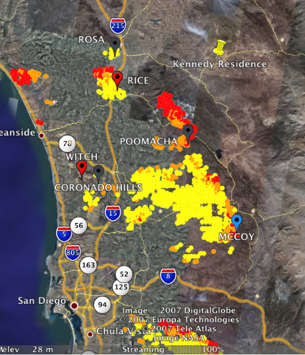

<figure class="alignright">
  
</figure>

A couple of people have called me in the last couple of days checking to see if Elisabeth and I were okay.  She drove up
to Los Angeles last night ([just in time][] too) and we're doing fine.  Her parents are much closer in Aguanga, CA...
about 12 miles northeast of the Poomacha fire.  I believe that fire is still 0% contained, but it looks
like the wind is blowing off-shore, away from her parents.

[just in time]: http://cbs2.com/local/local_story_297073557.html
