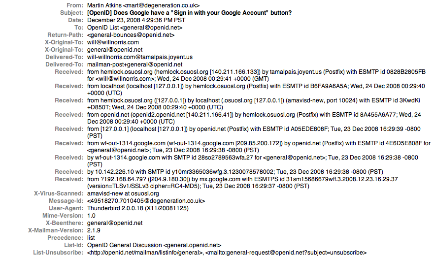
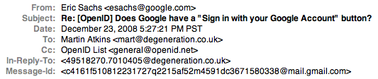
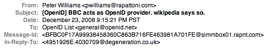
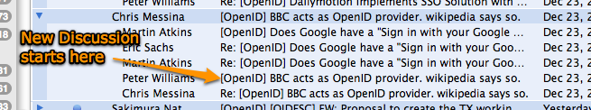

Most email clients [support the idea][] of "threaded messages"... that is, the client can group together individual
email messages that are part of the same conversation, or "thread".  This is a particularly useful feature on mailing
lists where multiple conversations are happening at the same time.  For example, the following screenshot of the [OpenID
General Discussion][] list shows two distinct message threads in Apple's Mail application:

<figure class="aligncenter">
  
</figure>

In order to match up messages that belong to the same conversation, email clients use two techniques.  First, they match
emails with the same subject line, which is mostly accurate.  Occasionally this will result in "false positives" where
unrelated emails are grouped together because the senders happened to use the same subject.  The second method is far
more accurate and makes use of a hidden portion of the email message which most people never see.  Emails, just like web
page requests include a number of hidden "headers" that carry extra information about the message.

<figure class="aligncenter">
  
</figure>

This includes information about the email client the sender used, the message priority, and the different servers that
handled the message along the way.  Each email message also includes a unique identification string called the
"Message-Id".  This string is unique for every email message in the world... no two are ever identical.  In the
screenshot above, the Message-Id is `<49518270.7010405@degeneration.co.uk>`.  If someone were to reply to that message,
the Message-Id of the original email would be included in the reply email as another hidden header aptly named
In-Reply-To:

<figure class="aligncenter">
  
</figure>

Any future replies would continue to include an In-Reply-To header with this value so that email clients can recognize
that they all belong to together and group them accordingly.  This method of conversation tracking is far more accurate,
but has one problem.  That problem occurs when some lazy person comes along and wants to send a message to the mailing
list, but instead of clicking on "New Message" in their mail client, they pick a message at random from the list, click
"Reply", and then clear out the subject and body of the message.  While this **looks** like a new message about a new
topic, because the person "replied" to a previous email instead of starting a new message, the previous Message-Id got
attached.  Note the following reply to the same email above, but now the subject has been changed from talking about a
Google sign-in button, to the BBC being an OpenID provider.  These are completely different discussions!

<figure class="aligncenter">
  
</figure>

If we go back to our first screenshot of the two message threads, we can see the this new message (as well as any of its
replies) get lumped right together with the original discussion.

<figure class="aligncenter">
  
</figure>

So today's lesson in email etiquette: If you're not actually replying to a particular email, **DON'T CLICK "REPLY"**.
Copy and paste the "To:" email address if you have to, but don't click reply!  There might be some grace here for emails
between individuals, but not on mailing lists, **especially** not on technical mailing lists.  (Not meaning to pick on
Peter in the screenshots above... he is not the only offender on the OpenID mailing lists, that just happened to be the
most recent occurrence).

Okay, that's my rant for the day... I'm good now.  Oh, and Merry Christmas. :)

[support the idea]: threading-enabled.png
[OpenID General Discussion]: http://openid.net/mailman/listinfo/general
