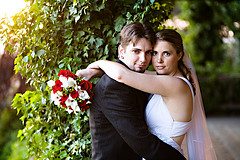

<figure class="alignleft">
  
</figure>

I've finally gotten around to uploading all of our professional wedding photos to our [Wedding Set][] on Flickr.
Additionally, they can be seen [as a slideshow][] or along with all the photos taken by our wedding guests in our
[Flickr Group][].  These are full resolution photos, primarily so that family and friends and can order very reasonably
priced prints.  Thanks go to Nic Dragomire of Tamarack Studios for such a wonderful job on our photos.

**A note to non-Flickr users**: You will need to have a Flickr account to order prints of any of the photos.  I
apologize for that, but the good news is that it's the same as any existing Yahoo! account, which most people tend to
already have anyway.

[Wedding Set]: http://flickr.com/photos/wnorris/sets/72157605578063570/
[as a slideshow]: http://flickr.com/photos/wnorris/sets/72157605578063570/show/
[Flickr Group]: http://flickr.com/groups/norris-wedding/
