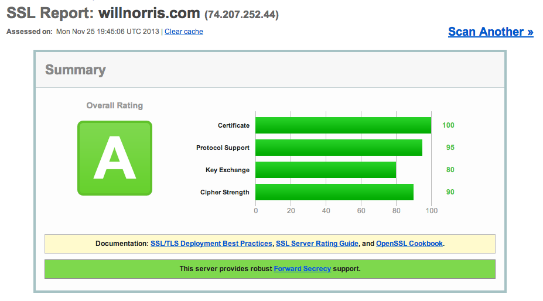

About a year ago, I switched this website to [only serve traffic using HTTPS][all-https], and I'm happy to say that
things have gone really smoothly in that time.  There have been a couple of occasions that I've allowed HTTP traffic and
removed the automatic redirect, but that was mostly to help debug clients that were having issues with SNI.  Otherwise,
things have just been humming right along, and today I finally got around to some upgrades I've been wanting to make to
my HTTPS setup.

[all-https]: /2012/12/all-https-all-the-time

## Perfect Forward Secrecy ##

Perfect Forward Secrecy (PFS) has been in the news a bit lately, as both [Facebook][] and [Twitter][] recently enabled
it on their main sites.  [Google has also supported PFS][google] for the last couple of years.  The Electronic Frontier
Foundation has a great article explaining [what PFS is and why it matters][eff], but in a nutshell it helps to protect
against the wide dragnet-style collection of data the NSA has reportedly been doing.  

Enabling PFS is really just a matter of selecting which ciphers your web server should use when establishing SSL
connections.  I followed the recommendations in [this article from Qualys][qualys] to configure my Apache web server.  I
host with Linode, and was previously using an Ubuntu 13.04 image, which ships with Apache 2.2 by default.  I could have
upgraded Apache directly, but I chose to just go ahead and upgrade the entire machine to Ubuntu 13.10, since that ships
with Apache 2.4.  That was by far the most painful part, only because there were some changes to the default Apache
configuration that tripped me up.  Otherwise, enabling PFS was surprisingly simple.  I did have some trouble with one
configuration line in the above article.  I had to list the cipher suites on a single line and colon-delimited, not
space-delimited:

    SSLCipherSuite EECDH+ECDSA+AESGCM:EECDH+aRSA+AESGCM:EECDH+ECDSA+SHA384:\
    EECDH+ECDSA+SHA256:EECDH+aRSA+SHA384:EECDH+aRSA+SHA256:EECDH+aRSA+RC4:\
    EECDH:EDH+aRSA:RC4:!aNULL:!eNULL:!LOW:!3DES:!MD5:!EXP:!PSK:!SRP:!DSS

SSLLabs (also run by Qualys) has a great tool for testing your SSL setup.  Here's [my
result](https://www.ssllabs.com/ssltest/analyze.html?d=willnorris.com):

<figure>
  
</figure>

[Twitter]: https://blog.twitter.com/2013/forward-secrecy-at-twitter-0
[Facebook]: http://www.theverge.com/2013/6/26/4468050/facebook-follows-google-with-tough-encryption-standard
[google]: http://googleonlinesecurity.blogspot.com/2011/11/protecting-data-for-long-term-with.html
[eff]: https://www.eff.org/deeplinks/2013/08/pushing-perfect-forward-secrecy-important-web-privacy-protection
[qualys]: https://community.qualys.com/blogs/securitylabs/2013/08/05/configuring-apache-nginx-and-openssl-for-forward-secrecy

## HTTP Strict Transport Security ##

The second thing I did was much easier, and that was to enable HTTP Strict Transport Security (HSTS).  From the
[Chromium website][hsts]: 

> HSTS allows a site to request that it always be contacted over HTTPS. [...] The issue that HSTS addresses is that
> users tend to type http:// at best, and omit the scheme entirely most of the time. In the latter case, browsers will
> insert http:// for them.
> 
> However, HTTP is insecure. An attacker can grab that connection, manipulate it and only the most eagle eyed users
> might notice that it redirected to `https://www.bank0famerica.com` or some such. From then on, the user is under the
> control of the attacker, who can intercept passwords etc at will.

This is enabled simply by returning a header in all HTTPS responses.  I added the following line in my `.htaccess` file,
instructing browsers to always access willnorris.com using HTTPS, and to remember that decision for about six months:

    Header add Strict-Transport-Security "max-age=16070400"

[hsts]: http://www.chromium.org/sts

## Little Brother ##

I just finished reading Cory Doctorow's book [Little Brother][] a few weeks ago, and really can't recommend it enough,
so I figured it was worth a plug here.  It finally got pushed to the top of my reading list after hearing Matt Cutts
[mention it on a recent episode of TwiG][twig].  Leo goes on to talk about Perfect Forward Secrecy a little bit in that
episode, and Matt even reveals that Little Brother was one of the reasons that Google began the effort to encrypt all
web traffic in the first place.  If you're at all interested in privacy and technology, it's a great read.

[Little Brother]: http://craphound.com/littlebrother/
[twig]: https://www.youtube.com/watch?feature=player_detailpage&v=icQtM64ah3g#t=2685
