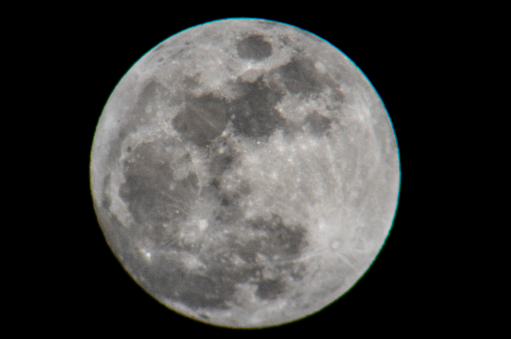

[Elisabeth][] got me a [Celestron Ultima 100][] spotting scope for Christmas this past year, and I
finally got to put it to use tonight photographing the moon. The full moon technically isn't until
tomorrow, but I didn't want to miss taking advantage of the clear night we were having.

I still need to practice a lot to get a really sharp image, both with the slight shakiness of the
tripod and getting the manual focus adjustment just right. But there's still something really
amazing about seeing it directly through a scope yourself versus just seeing pictures.

[Elisabeth]: https://notsoserendipitous.com/
[Celestron Ultima 100]: https://www.celestron.com/products/ultima-100-45-degree-spotting-scope

<figure>
  
</figure>
