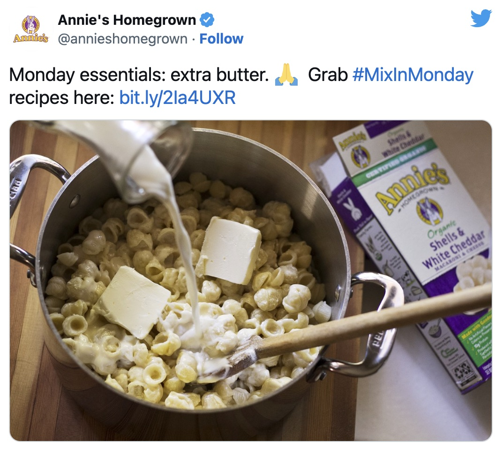

We were a Kraft household growing up, certainly eating our fair share of blue
box mac and cheese. The steps to make it are quite simple: cook the pasta and
drain out the water, put the pasta back in the pan, then stir in milk, butter,
and the cheese packet.  I must have done this hundreds of times throughout my
childhood, never once questioning these instructions. Why would I? Of course
*Kraft* of all companies knows how to make a pot of mac & cheese!  I mean, they
even tweeted out the instructions, lest you throw away the box and find yourself
stranded:

<figure class="aligncenter">
  
</figure>

It wasn't until a few years into my marriage that I realized that I had been
making mac and cheese **wrong** my entire life. Surely there are different ways
to make mac and cheese, but is it really fair to say that the Kraft way is
*wrong*? Yes. Yes, it is. What I saw my wife do was nothing less than
life-altering. Okay, well at least I still think about it every time I make mac
and cheese, some 10 years later.

You don't mix the sauce ingredients into the pasta-filled pan like a monster!
That is the way to clumpy, grainy, cheese-powder disaster.  Instead, leave the
pasta in the strainer and make the sauce in the empty pan first!  Only once it
is nice and smooth do you add the pasta back in so that you get a nice even
coating. (In essence, you're making a roux.  Or at least you would be if the
cheese packet has flour in it. I'm not sure if it does.)

It turns out that this is what [Annie's](https://www.annies.com/) has instructed
on their boxed mac and cheese all along:

<figure class="aligncenter">
  {{}}
</figure>

On the evening that I achieved macaroni enlightenment, I was hesitant to
research whether it was my own mother or Kraft that had led me astray as a
child. I guess it was a small comfort to discover that it was indeed Kraft,
though the betrayal I felt was palpable. Suffice it to say, we're an Annie's
household now.

That said, I can't fully explain what's going on in this picture. I'm willing to
accept that this was staged just for the picture, and that someone did not, in
fact, have a serious lapse in macaroni-and-cheese judgement.

<figure class="aligncenter">
  
</figure>
