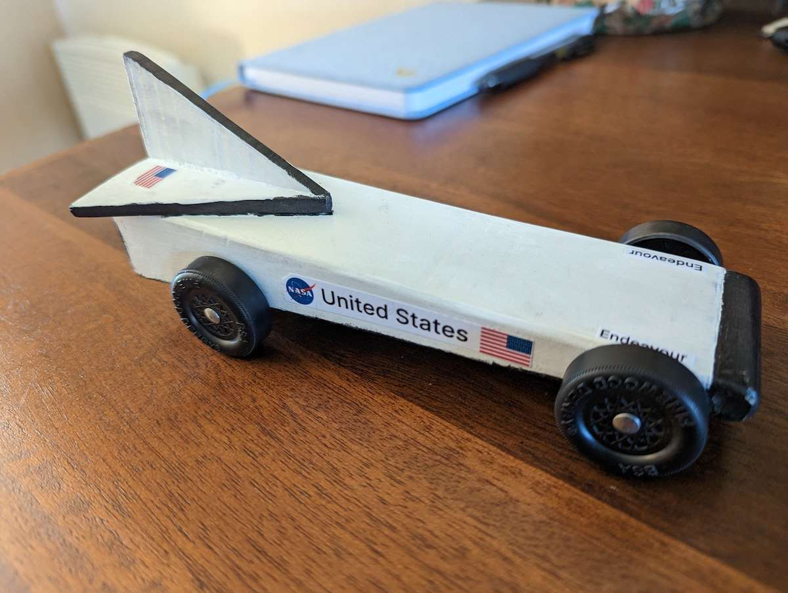

Earlier this year, I organized and ran the Pinewood Derby for my son's [Cub Scout Pack].
I had always participated in the Pinewood Derby when I was a Scout, and attended a few as an adult,
but I'd never actually organized or run one myself.
This is an overview of the software I used, how I set it up, and how [Tailscale] brought it all together.
(Disclaimer up front: I also work at Tailscale.)

<figure class="alignright" style="max-width: 300px">
  <a href="optimus-prime.jpg">{{}}</a>
  <figcaption>My five year old son's Optimus Prime car from this year. (Dad helped.)</figcaption>
</figure>

The [Pinewood Derby] has been a favorite scouting event for over 70 years,
with scouts designing, building, and racing a model car made from a block of pine wood.
Awards are given for the fastest cars, but typically also for most creative designs.
It's no exaggeration to say that some kids stay in scouts just for the pinewood derby.

The complexity of a scout pack's pinewood derby setup can vary pretty wildly.
Our pack races on a 6 lane, 40 foot aluminum track from [BestTrack] with a [Champ Timer].
The timer interfaces with race management software specifically designed for these types of races
that manages the racing brackets, records the times for each heat, and calculates the rankings.

## DerbyNet

In the past, our pack has used [GrandPrix Race Manager] which,
as best as I can tell, is one of the more popular software options.
However, this year I chose to instead use [DerbyNet], which is an open source alternative.
Besides being open source (which was great because I did make some small customizations),
I also really liked how DerbyNet is architected.
The application itself is a simple web application written in PHP with a SQLite database.
System requirements are minimal and everything is managed through the browser,
even interfacing with the race timer using the [Web Serial API].

You do need somewhere to actually run the application,
which can be on a local laptop, a raspberry pi, or on a remote cloud server.
And you do need at least one client that can access that server to serve as the primary coordinator for the race.
Then, any number of additional devices can be used in different roles,
such as a checking in scouts, kiosks to display race results, or set up with a camera to provide instant replays.

## Our Setup

We held our pinewood derby at the [local fire station],
which is a lot of fun because the kids get to hang out in the apparatus bay and look at the trucks.
The battalion chief was very gracious and accommodating,
but we weren't completely sure whether we'd be able to use the station's wireless network.
I opted to run DerbyNet directly on my laptop so that in a worst case scenario,
I could do everything locally from a single machine without any network connection.
That ended up just being a local Caddy web server (after I gave up trying to run it in Docker),
PHP to run DerbyNet, and connecting to our race timer over a USB-to-serial adapter.

The Caddy config was very simple:

``` caddyfile
:8080 {
  root website
  file_server {
    index index.html index.php
  }
  php_fastcgi unix//opt/homebrew/var/run/php-fpm.sock {
    env DERBYNET_CONFIG_DIR /var/lib/derbynet
    env DERBYNET_DATA_DIR /var/lib/derbynet
  }
}
```

<figure class="alignright" style="max-width: 300px">
  <a href="endeavour.jpg">{{}}</a>
  <figcaption>My eight year old son's Space Shuttle Endeavour car from this year.</figcaption>
</figure>

Once we had that working, we added:
 - several volunteers' phones used to check-in Scouts as they arrived
 - an iPad used by the track manager to know which cars to place on which lanes
 - a Pixelbook set up on a table showing times and standings at the end of each run
   (ideally this would have been connected to a large monitor)

DerbyNet also allows parents to vote on the design awards,
and we knew that was something we wanted to support if possible.
If the network wasn't cooperative, the leaders could always just select winners.

Unfortunately, there were indeed issues with fire station's wifi,
so we ended up having to tether all of the devices off of cell phone hotspots.
My Macbook and Pixelbook were connected to my phone, the track manager had his iPad connected to his phone,
and the volunteers and parents were on their individual phones.
But we needed all of them to be able to reach the DerbyNet server running on my laptop; tethered to a phone.

Our device setup looked a little something like this:

<figure>
  <a href="devices.png"></a>
</figure>


## Tailscale makes the connection

So we have a dozen or so different devices on disparate networks that we need to all connect to each other.
Fortunately, this is exactly what [Tailscale] is designed for:
providing secure access between remote devices and resources.
Of course, if I had all of these devices on the same tailnet, there wouldn't really be much more to do.
Every device would enable Tailscale and go to the [MagicDNS] hostname for the server.
That's actually what I did for the two devices of my own (the MacBook and Pixelbook),
both of which had Tailscale installed and set up ahead of time.
Because they were tethered on the same phone, Tailscale connected them directly over local IP addresses.

To provide access for the track manager, I used Tailscale [Funnel] to expose the DerbyNet server to the public internet.
On my laptop, that was as simple as running:


``` sh
$ tailscale serve https / http://127.0.0.1:8080
$ tailscale funnel 443 on
```

The track manager (who was tethered on a separate phone) was then able to navigate to my same MagicDNS hostname
(something like *https://derby.tailnet.ts.net*) which routed through Tailscale's public funnel servers and down to my laptop.
It worked amazingly well, especially considering that Funnel was a **very** new feature at the time.

We ran the whole pinewood derby like this without even the slightest hiccup.
For the parents, I could have simply had them go to the same MagicDNS hostname,
but I wanted try something a little different and easier to remember.
I set up a reverse proxy on [derby.pack263.org] to direct traffic to Tailscale Funnel, which in turn routed it to my laptop.
It wasn't really necessary, but the reverse proxy was so simple to do in Caddy
(with automatic SSL cert provisioning and all):

``` caddyfile
derby.pack263.org {
  reverse_proxy https://derby.tailnet.ts.net {
    header_up Host {upstream_hostport}
  }
}
```

So the parents were able to access the DerbyNet server running on my laptop from their phones to vote on cars.
I found out later that we even had one scout that was sick at home
and was refreshing the DerbyNet site to see the results as the races were happening.

The final traffic flow was something like this:

<figure>
  <a href="network.png"></a>
</figure>

I technically did run the reverse proxy on a cloud VM that I had available,
but otherwise everything was just vanilla Tailscale with nothing too exotic.
And even the reverse proxy was just a nice to have, I could have just as easily set up a simple redirect.

To be perfectly honest, it did feel a little risky to be trying something with
so many moving parts for my very first pinewood derby.
But I really couldn't have been happier with how stable it was and how it turned out,
and now I can't imagine doing an event like this any other way.

[Cub Scout Pack]: https://www.pack263.org/
[Tailscale]: https://tailscale.com/
[Pinewood Derby]: https://en.wikipedia.org/wiki/Pinewood_derby
[BestTrack]: https://www.besttrack.com/
[Champ Timer]: https://www.besttrack.com/champ_timer.htm
[GrandPrix Race Manager]: http://www.grandprix-software-central.com/gprm/
[DerbyNet]: https://derbynet.org/
[Web Serial API]: https://developer.mozilla.org/en-US/docs/Web/API/Web_Serial_API
[local fire station]: https://www.coastsidefire.org/fire-stations
[MagicDNS]: https://tailscale.com/kb/1081/magicdns/
[Funnel]: https://tailscale.com/kb/1223/tailscale-funnel/
[derby.pack263.org]: https://derby.pack263.org/
