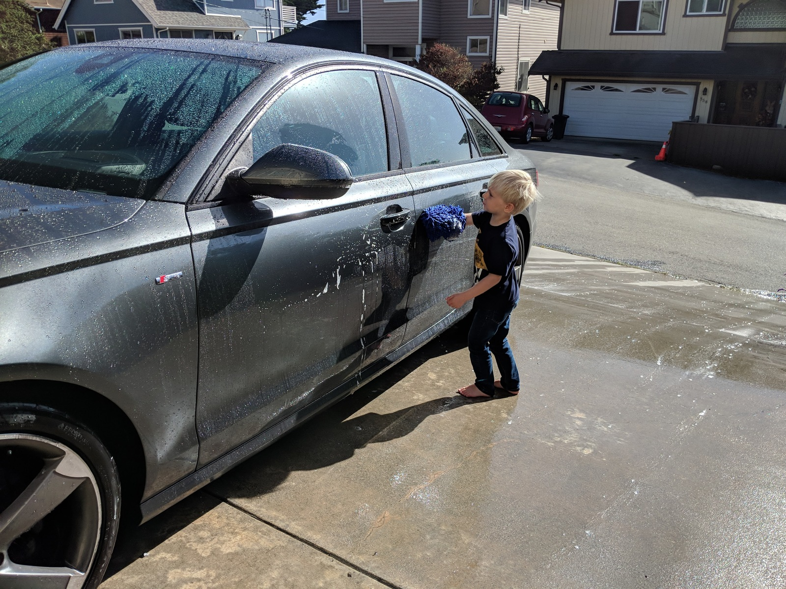

I've told this story a few times, but have never written it down.
For the last 7 years, I've driven a dark gray 2015 Audi A6 Quattro TDI Prestige.
It has a 3L V6 diesel engine and the S line trim package.
If you don't know what all that means, it's okay because I don't either.
But suffice it to say that it's a really nice car that is a lot of fun to drive!
In fact, it's **way** nicer of a car than I would normally ever drive.
How I got it is kind of a bittersweet story.

## Shawn Pearce

Roughly 8 of the 10 years I spent at Google were in their [Open Source Programs Office].
Google's OSPO was primarily responsible for all things open source at the company,
but it also ended up being the home of a ragtag group of amazing developers
that were working on open source adjacent projects, but didn't necessarily fit into OSPO's core mission.
For example, we had [Ian Hickson] building the [WHATWG] and writing what would become HTML5,
[Dan Brickley] of semantic web fame working on schema.org and related projects,
[Jeremy Allison] working on Samba, and [Junio Hamano] maintaining git.
If I remember [Chris DiBona]'s telling of the story correctly,
Shawn started out largely as part of this bunch.
[Shawn] had been really active in the git community and had developed an independent Java implementation called JGit.
Chris really wanted him at Google, but there wasn't really a team to put him on,
so Chris kind of hid him inside of OSPO.

By the time I joined the open source office, Shawn had built [Gerrit Code Review],
the Git-on-Borg service, and was managing a team that ran all of the git hosting for [Android] and [Chromium].
After a year or two, Shawn took over as the manager of my team as well, and I worked for him for the next several years.
I think Shawn was somewhat of a reluctant manager, but he really was a good one.
He was an engineer at heart, and never stopped building no matter how many direct reports he had.
I learned a ton working with Shawn, and I became a much better engineer and later a better manager because of him.

## Shawn's Car

I don't remember exactly when Shawn got his A6, but I remember the weeks leading up to it.
He had spent a ton of time researching what he wanted and how to get it.
I guess he ordered the car directly from the Audi factory in Germany,
because I remember he had very strict instructions for the dealership that was taking delivery.
They were not to unwrap the car, or so much as touch it.
When it arrived, Shawn immediately had it sent to "his guy" that put on whatever kind of fancy clear wrap you do to protect the paint.

He was insistent that it only ever by hand-washed with a special kind of soap and microfiber cloths,
and would tell the story of how upset he got when his wife Sara once took it to a car wash.
One of the first times he brought it to the office, he took me out to the parking lot to show off the parking cameras.
I was amazed at how the different camera angles were stitched together to give a top-down 360 degree view of the car.
I think that is a lot more common now, but at the time I had never seen it before.
I never thought of Shawn as an overly materialistic person, but he definitely loved that car.

## Shawn's Death

In late 2017, Shawn was diagnosed with stage 3 lung cancer.
It was a surprise to everyone because he was generally healthy and didn't have any of the traditional risk factors for lung cancer.
He had enough time and energy to make arrangements for his wife and their two young sons,
and a few of us from the office were able to visit with him at home a few days before [he died] in early 2018.

Shawn and Sara had already made plans for her and the boys to move back to the east coast where her family was.
They had either already sold the house or were getting it ready to sale,
and one of the larger items they still needed to sell was Shawn's car.
It just worked out that I was actually in the market for a second vehicle at the time.
Our second child had just been born that year, and sharing a single car was no longer working.
I absolutely had not imagined getting anything like an A6, but it made sense.
I got a fair price for a car that had been meticulously cared for,
and I was able to give Sara one less thing she needed to worry about.

<aside class="alignleft outset"><figure>
  {{}}
  <figcaption>My son, Gabriel, helping wash the car in 2018.</figcaption>
</figure></aside>

When I bought the car, I immediately did a bunch of research on the right kind of car soap
and washcloth that wouldn't damage the clear coating.
For years, every time I would hand-wash the car, I would think of Shawn and reminisce.
I kept his custom "GRAY6" license plate he had on the car for several years,
later replacing it with a different custom plate, but still keeping the original GRAY6 plates.
I'm sorry to say that I'm not quite so strict about the hand-washing rule anymore,
but I still think of him anytime I'm at a carwash or sometimes just when I'm using the parking cameras.

The car is becoming less practical for us now, and we've begun to have conversations about eventually replacing it.
Maybe I'll keep it around until my oldest son is old enough to drive,
then I can give it to him and tell him the story of how great a guy Shawn was and how much he loved this car.

[Open Source Programs Office]: https://opensource.google/
[Ian Hickson]: https://ian.hixie.ch/
[WHATWG]: https://whatwg.org/
[Dan Brickley]: https://www.w3.org/People/DanBri/
[Jeremy Allison]: https://www.samba.org/~jra/
[Junio Hamano]: https://git-blame.blogspot.com/
[Chris DiBona]: https://dibona.com/
[Shawn]: https://github.com/spearce
[Gerrit Code Review]: https://www.gerritcodereview.com/
[Android]: https://android.googlesource.com/
[Chromium]: https://chromium.googlesource.com/
[he died]: https://sfconservancy.org/blog/2018/jan/30/shawn-pearce/
